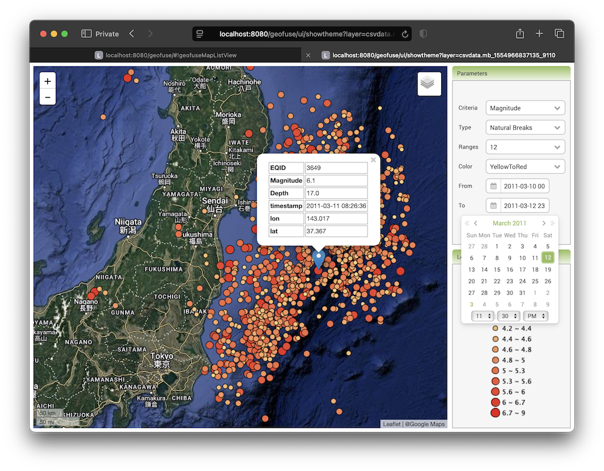
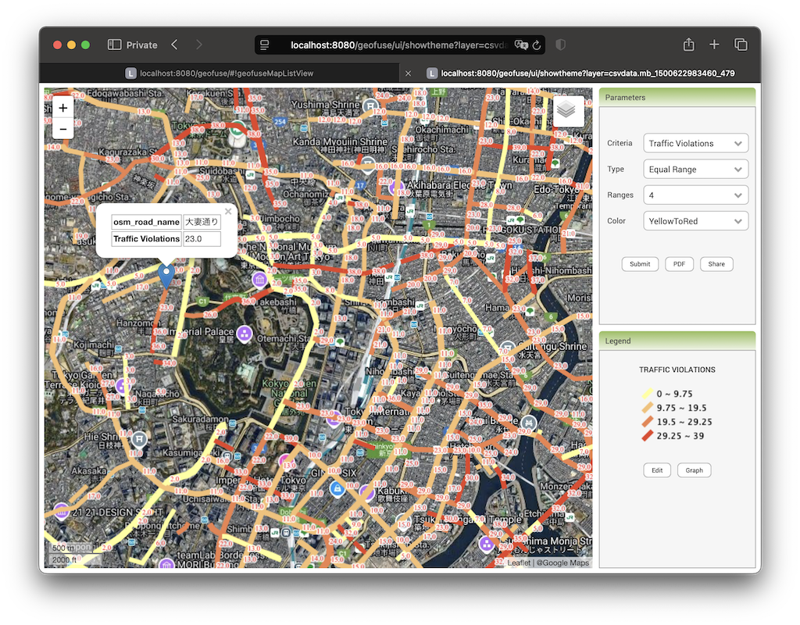
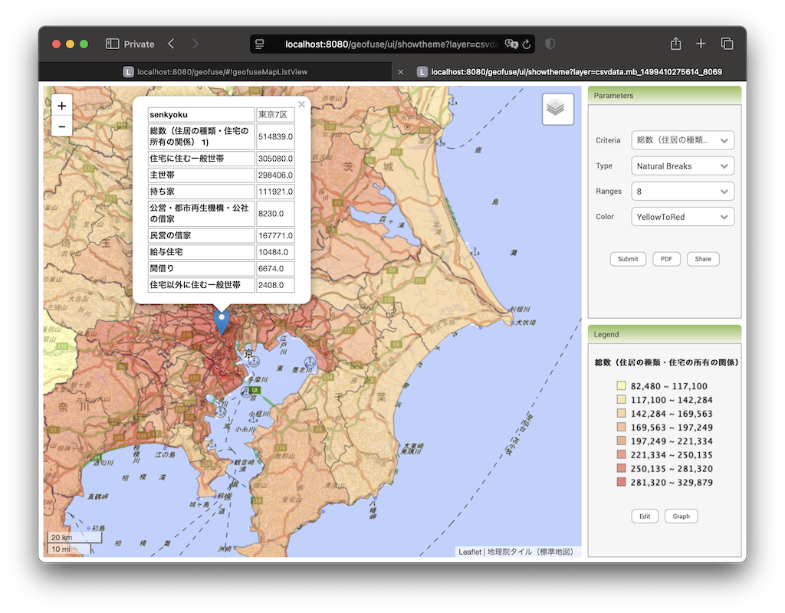

### GeoFuse 

GeoFuse is a Location Intelligence Tool that can easily link any 
Statistical Data with Geographic Data and display informative Thematic Maps. 

These Thematic Maps are rendered server-side using [GeoServer](https://geoserver.org) mapping server for fast display, even with very dense 
statistical and geographic data sets. 

The statistical data can be uploaded in CSV format, and a map will be created
if the first column name of the CSV data matches a specific column name in the
attribute table of the map data. A point map data will also be created if the 
last 2 columns of the CSV contain lon(Longitude)/lat(Latitude) information.

### Sample Thematic Maps of GeoFuse

* 2011 Earthquake Data that is filtered by its **Timestamp** data.



* Traffic Violations Count linked to OSM Road data set



* Census Data of each defined Election Area Polygon 




Prerequisites
-------------

* [Tomcat](http://tomcat.apache.org)
* [GeoServer](http://www.geoserver.org)
* [PostGIS](http://www.postgis.org)

To Install
----------
* download the source code and build a WAR file using Maven

```
  mvn clean install
```

* copy the created WAR file into tomcat_dir/webapps directory
* start tomcat

Configure PostgreSQL
--------------------
* create a database and install PostGIS

```  
  createdb geofuse
  psql -c "CREATE EXTENSION postgis" geofuse
  psql -c "CREATE EXTENSION postgis_topology" geofuse
```

* create the schemas that will contain the dummy and metadata tables found in createtabs.sql

```
  psql -f createtabs.sql geofuse
```

* create the deltemp function that will delete the temporary files

```
  psql -f deltemp.sql geofuse
```

* add map layers (polygons/lines/points) which will later be used for thematics. it will be best to place the table into the created "geodata" schema. 

Configure GeoServer
-------------------
* Create a Workspace named `` geofuse ``


* Create a new PostGIS DataStore


* Name the new Store as <strong>geofuse</strong> and set the database parameter to the <strong>geofuse</strong> database created. Set the schema parameter to <strong>geodata</strong>


* Create a new <strong>SQL View Layer</strong>


* Set the layer name as <strong>geolink</strong> and the SQL Statement as

```sql
  select a.*,the_geom from %linktab% a,%maptab% b where a.col0 = b.%mapcol%
```

* Set the View Parameters to the values below and erase the values of the <strong>Validation regular expression (正規表現を検証)</strong>

```
  linktab = geodata.dummy
  maptab  = geodata.mapdummy
  mapcol  = mapcol
```


* Press the <strong>Refresh</strong> button to update the Columns list. Change the SRID of the <strong>the_geom</strong> column to 4326 and press the Save Button.


* After Pressing the Save button, set the Bounding Box Parameters to -180 -90 180 90 in the main layer creation page and then Save.


* Create another SQL View Layer using the procedure set above. Set the layer name as <strong>geolink_pt</strong> and the SQL Statement as below

```sql
  select * from %linktab%
```

* Set the View Parameters to the values below and erase the values of the <strong>Validation regular expression (正規表現を検証)</strong>

```
  linktab = geodata.dummy_pt
```

* Press the <strong>Refresh</strong> button to update the Columns list. Change the Geometry Type to <strong>Point</strong> and the SRID of the <strong>the_geom</strong> column to 4326 and press the Save Button.


* After Pressing the Save button, set the Bounding Box Parameters to -180 -90 180 90 in the main layer creation page and then Save.


Populate the MapLinker table in PostgreSQL
----------------------------------------

Insert the following for each map layer that will be used to create thematic

* link colunm (i.e. 'prefocode)
* Map table name with schema (i.e. 'geodata.prefectures')
* created geoserver view name (i.e. 'geofuse:geolink')
* type of layer (i.e. 'polygon'))  

```sql
    insert into geofuse.maplinker values ('prefcode', 'geodata.prefecture', 'geofuse:geolink', 'polygon');
```

To View Geofuse
----------------------

In your browser, go to ``http://localhost:8080/geofuse/``

   NOTE: This application will try to get only metric (numeric) fields to
      display in the Thematic attribute list. For numeric ID fileds 
      (i.e. Prefecture-ID,Country-ID,etc.), add a suffix "-ID" to the 
      fieldname so that it will not show in the attribute list.

To Customize:
-------------

```
  tomcat_dir/webapps/GeoFuse/classes/properties/
      database.propertiess
      thematic.properties
```


Adding new postgis table

Adding new background layer for printing

Adding new colorscheme


<tomcat dir>/webapps/geothematics/WEB-INF/classes/properties/thematic.properties

NOTE: the ColorNames and Colors should have equal number of items, otherwise
      no color choices will appear in the Colors list of the web page.


License
-------
Released under GPL.